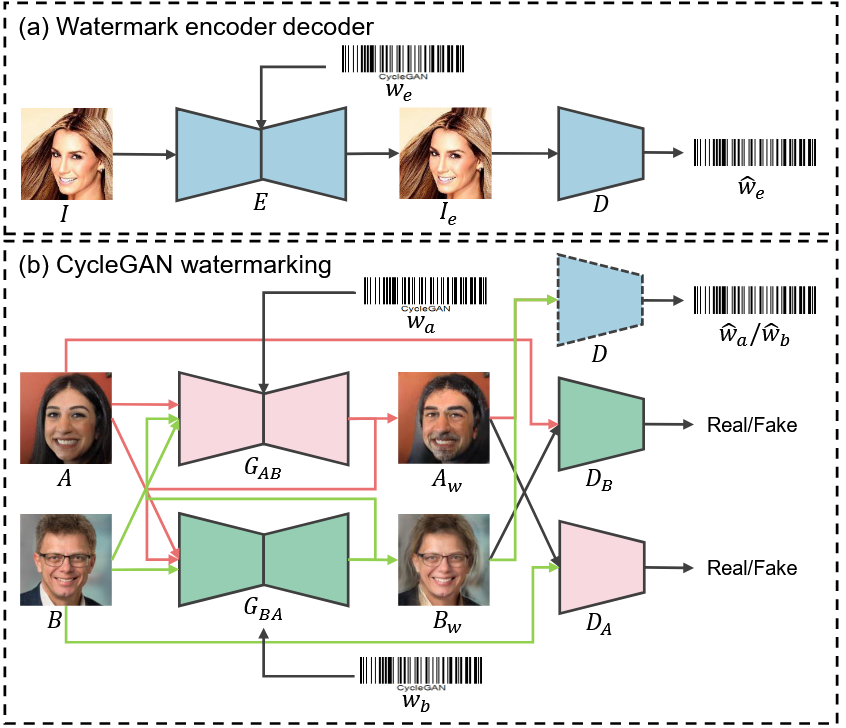

# A CycleGAN Watermarking Method for Ownership Verification

Official PyTorch Implementation of the paper:
Dongdong Lin, Benedetta Tondi, Bin Li, and Mauro Barni, “**A CycleGAN Watermarking Method for Ownership Verification**,” *IEEE Transactions on Dependable and Secure Computing,*  2024, 22(2), 1040-1054.

---

## 🔧 Features

- **Dedicated to cycle-structure GANs** — supports watermarking in CycleGAN, DualGAN, and DiscoGAN.
- **Pre-trained and frozen watermark decoder** — enables stable watermark extraction during training.
- **Balanced objective design** — jointly optimizes image quality and watermark accuracy using tailored loss.
- **Statistical ownership verification** — supports hypothesis testing–based watermark validation.
- **Robust to post-processing** — watermark remains detectable after JPEG, cropping, noise, etc.
- **Resistant to substitute-model attacks** — watermark can still be extracted when models are stolen or re-trained.

---

## 📦 Repository Structure

```
CycleGAN-Watermarking/
│── data/                      # Training/test datasets
│── models/                    # CycleGAN generator/discriminator + watermark modules
│── util/                      # Losses, metrics, helper functions
│── train.py                   # Training script
│── test.py                    # Watermark extraction & evaluation
└── README.md                  # (this file)
```

---

## 🚀 Quick Start

### 1. Clone the repository

```bash
git clone git@github.com:MrDongdongLin/CycleGANWM.git
cd CycleGANWM
```

### 2. Prepare dataset

Place your dataset in:

```
data/
 ├── trainA/      # Original images (domain A)
 ├── trainB/      # Watermarked images (domain B)
 ├── testA/
 └── testB/
```

### 3. Train the model

```bash
python train.py
```

### 4. Evaluate watermark extraction

```bash
python test.py
```

---

## 📘 Method Overview



---

## 📄 Citation

If you use this code or dataset, please cite our work:

```bibtex
@article{linCycleGANWatermarkingMethod2024,
  title        = {A {CycleGAN} Watermarking Method for Ownership Verification},
  author       = {Lin, Dongdong and Tondi, Benedetta and Li, Bin and Barni, Mauro},
  year         = {2024},
  vol          = {22},
  journal      = {IEEE Transactions on Dependable and Secure Computing},
  pages        = {1040-1054},
}
```